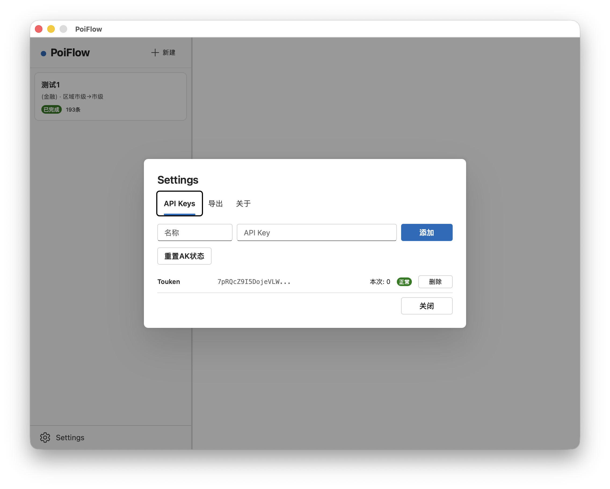
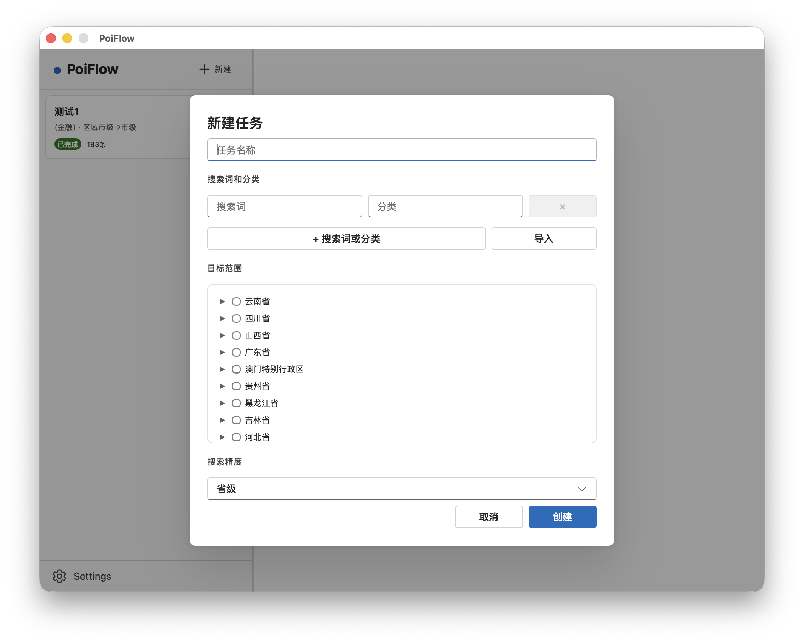
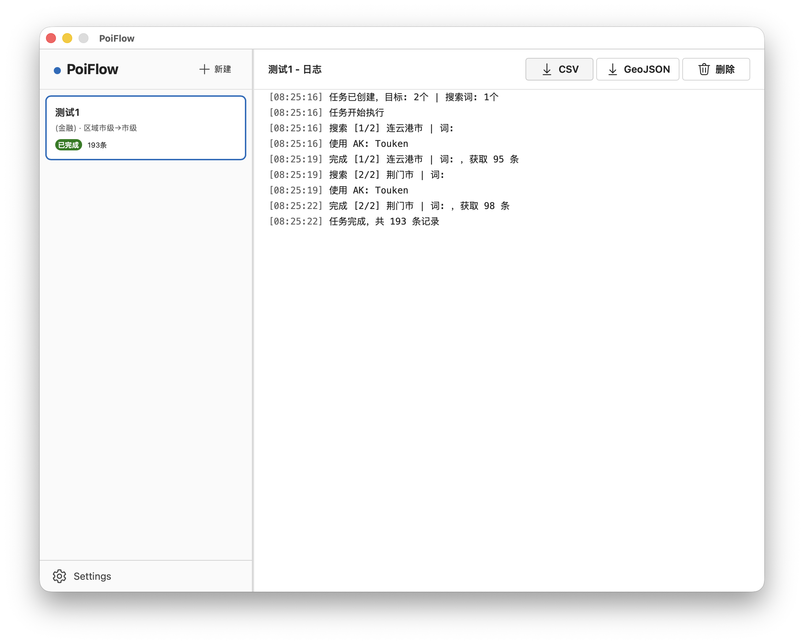

<p align="center">
  <strong>PoiFlow</strong><br>
  <em>百度POI数据采集工具 · 行政区划检索 · 多AK并发 · CSV/GeoJSON导出</em>
</p>

<p align="center">
  <a href="https://go.dev/dl/"></a>
  <a href="LICENSE"></a>
  <a href="https://github.com/touken928/PoiFlow/releases"></a>
  <a href="https://github.com/touken928/PoiFlow/stargazers"></a>
</p>

> 本软件仅供学习研究。使用者须遵守百度地图API服务协议及相关法律法规。

## 功能

- **行政区划检索** — 省/市/区县三级结构检索百度 POI，坐标自动转换 WGS84
- **多搜索词** — 一个任务可配置多个搜索词和分类，支持从文件批量导入
- **多 AK 管理** — 命名管理多个 API Key，自动轮转、2 QPS 限流、失败自动切换
- **断点续采** — 结果实时写入磁盘，暂停/重启后继续不重复
- **任务持久化** — 状态持久化到磁盘，重启自动恢复，运行中任务转为暂停
- **双精度查询** — 目标可细化到省/市/区县任意层级执行检索
- **CSV / GeoJSON 导出** — 支持自定义导出字段

## 使用

Windows 用户从 [Releases](https://github.com/touken928/PoiFlow/releases) 下载。其他系统需 Go 1.23+、Node.js 18+、Wails CLI：

```bash
git clone https://github.com/touken928/PoiFlow.git
cd PoiFlow
wails dev      # 开发模式
wails build    # 构建当前平台
```

1. 左下角 **Settings** → **API Keys** 添加百度 API Key

   

2. 点击 **新建**，填写搜索词和分类（至少一个，支持从“搜索词，分类”的文本文件导入），从树形列表选择目标区域

   

3. 任务自动排队执行，右侧面板实时显示日志

   

4. 暂停/继续/重试/删除任务，完成后导出 CSV 或 GeoJSON

## 项目结构

```
app.go + main.go          # Wails 桥接 + 入口
internal/akpool/           # AK 池（轮转、令牌桶限流、失败切换）
internal/store/            # config.yaml 读写（AK 配置 + 导出字段）
internal/task/             # 任务队列、执行器、日志、续采
internal/exporter/         # CSV / GeoJSON 导出
pkg/baidu/                 # 百度 Place API v3 客户端 + BD09→WGS84
pkg/division/              # 内嵌行政区划数据（china.yml）
```

MIT License
