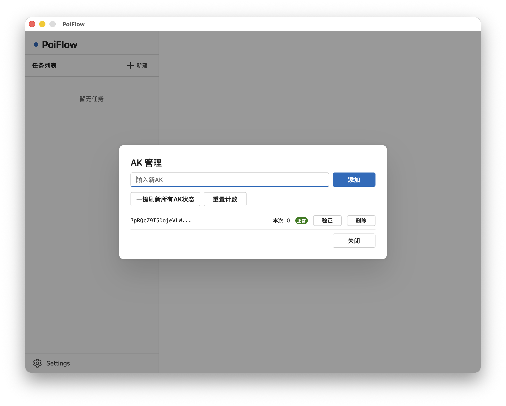
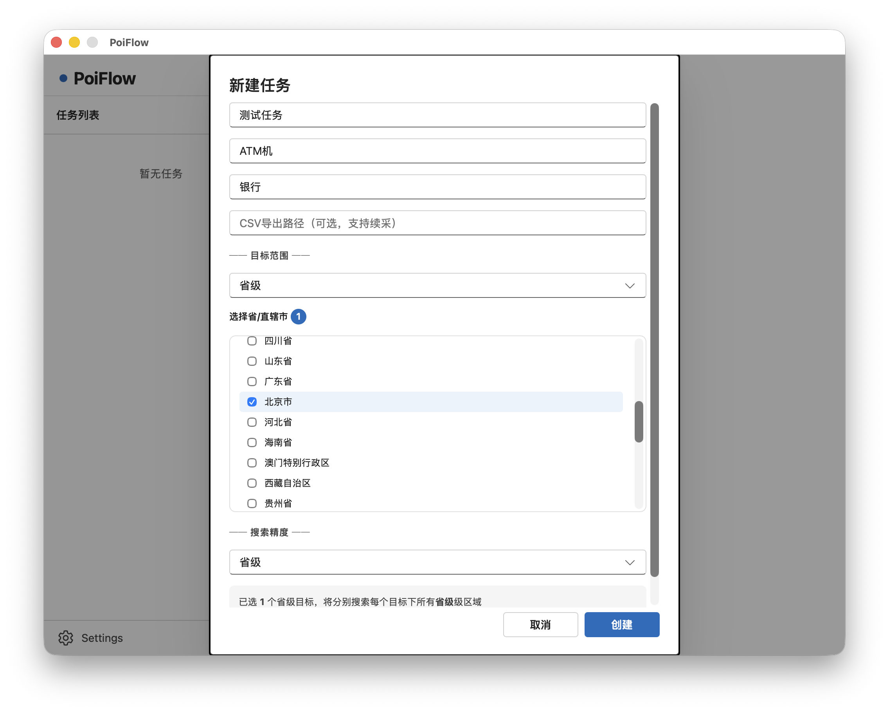
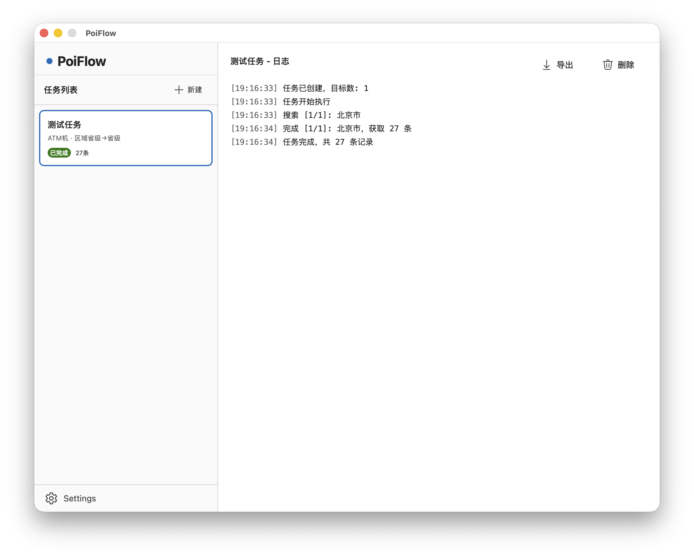

<h1 align="center">PoiFlow</h1>

<p align="center">
  <strong>百度地图POI批量采集工具 · 行政区划检索 · 多AK并发 · CSV导出</strong>
</p>

<p align="center">
  <a href="https://go.dev/dl/"></a>
  <a href="LICENSE"></a>
  <a href="https://github.com/touken928/PoiFlow/releases"></a>
  <a href="https://github.com/touken928/PoiFlow/stargazers"></a>
</p>

> ⚠️ **合法使用声明**
> 本软件仅供学习研究使用。用户必须遵守百度地图 API 服务协议及相关法律法规，
> 不得用于任何非法用途。使用者需自行承担全部法律责任。

## 功能

- **行政区划检索**：按省/市/区县三级结构检索百度 POI 数据
- **双粒度任务**：区域粒度（选择目标级别） + 查询粒度（实际检索细分到哪一级）
  - 例：选择省级目标，查询粒度设为区县级 → 自动展开为所有区县逐一检索
- **多 AK 管理**：支持同时配置多个百度 API Key，自动轮转和限流（每 AK ≤ 3 QPS）
- **失败自动切换**：AK 额度耗尽或失效时自动切换到下一个可用 AK
- **坐标转换**：百度 BD09 坐标自动转换为 WGS84
- **断点续采**：指定 CSV 导出路径后实时追加写入，重复运行自动跳过已有 UID
- **日志监控**：实时查看每条检索任务的执行日志

## 下载

GitHub Releases 页面提供 Windows 版本直接下载使用。

其他操作系统用户请自行编译：
- 前置要求：Go 1.23+、Node.js 18+、Wails CLI
- 克隆后执行 `wails dev` 启动开发模式，或 `wails build` 编译

## 使用

1. 打开软件，在左下角 **Settings** → 添加百度地图 API Key

   

2. 点击 **新建** 创建采集任务

3. 填写搜索词（如：ATM机）和可选分类（如：银行）

4. 选择**区域粒度**（省/市/区县）并勾选目标

5. 选择**查询粒度**（实际API请求细分到哪一级）

6. 可选：指定 CSV 路径以支持实时写入和断点续采

   

7. 任务自动加入队列顺序执行，可在右侧面板查看实时日志

8. 任务完成后点击 **导出** 保存为 CSV 文件

   

## 项目结构

```
PoiFlow/
├── app.go                 # Wails 桥接层
├── main.go                # 入口
├── internal/
│   ├── akpool/            # AK 池（轮转、限流、失败切换）
│   ├── akstore/           # AK 持久化（config.yaml）
│   ├── task/              # 任务系统（队列、执行、日志、CSV续采）
│   └── exporter/          # CSV 批量导出
├── pkg/
│   ├── baidu/             # 百度 Place API v3 客户端 + 坐标转换
│   └── division/          # 中国行政区划数据（内嵌 YAML）
└── frontend/
    └── src/App.tsx        # Fluent UI 前端
```

## License

MIT
